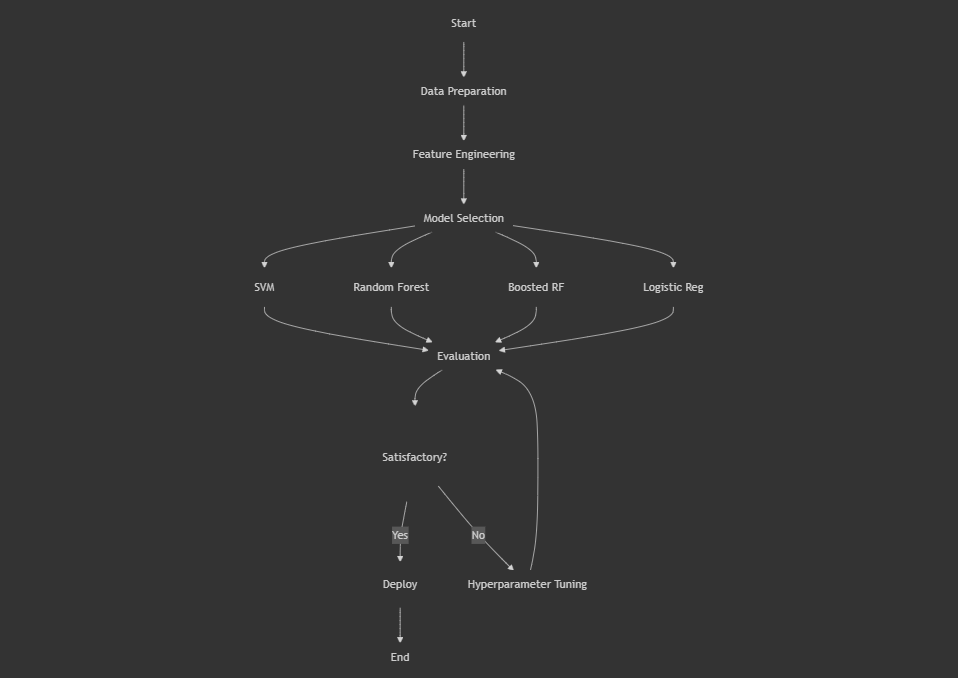

# ML-ImmuneProfiler: Machine Learning Driven Immune Cell-Type Classifier

*An immune cell classification framework utilizing advanced supervised and unsupervised learning techniques*

<p align="center">
  <i>Transforming single-cell RNA sequencing data into precise immune cell classification</i>
</p>


---
<br>
<div align="center">
  
  
  
  
  
  
  
</div>

<br>
<br>

<p align="center">
  
  
  
</p>


## Table of Contents

- [ML-ImmuneProfiler: Machine Learning Driven Immune Cell-Type Classifier](#ml-immuneprofiler-machine-learning-driven-immune-cell-type-classifier)
  - [Project Overview](#project-overview)
  - [Project Structure](#project-structure)
  - [Project Workflow](#project-workflow)
  - [Research Methodology](#research-methodology)
  - [Technologies Used](#technologies-used)
  - [Installation & Environment Setup](#installation--environment-setup)
  - [Analysis & Execution](#analysis--execution)
  - [Results & Visualizations](#results--visualizations)
  - [Reproducibility & Validation](#reproducibility--validation)
  - [References](#references)

## Project Overview

**ML-ImmuneProfiler** is a sophisticated machine learning framework designed for accurate classification of immune cell types from single-cell RNA sequencing data. This project synthesizes various ML techniques to deliver robust cell type identification, with applications in immunology, precision medicine, and computational biology.


> [!NOTE]
> **Key Components**
> - **Advanced Data Processing:** Robust preprocessing pipelines for high-dimensional scRNA-seq data
> - **Multi-model Architecture:** Implementation of diverse ML algorithms including Random Forests, Boosted Random Forests, Support Vector Machines, Logistic Regression, and clustering techniques
> - **Comprehensive Evaluation:** Rigorous assessment using ROC curves, precision-recall curves, confusion matrices, silhouette scores, and accuracy metrics
> - **Interpretability Framework:** Feature importance analysis and model explanation techniques
> - **Reproducible Environment:** Complete configuration for both CPU and GPU environments


## Project Structure


### 📂 Config
- 📄 BRF_RF.yaml - Configuration for Boosted Random Forest and Random Forest models
- 📄 env.yml - Environment configuration file for EDA and unsupervised notebook
- 📄 gpu_env.yml - GPU-specific environment configuration for SVM notebook
- 📄 System_Info_BRF_RF.txt - System information for BRF/RF models
- 📄 System_Info_unspv_spv.txt - System information for supervised/unsupervised models

### 📂 Data
- 📄 scRNA-seq_raw_data_curation.csv - Tabulated list of raw single-cell RNA-seq datasets curated from 10X Genomics database
- 📄 batch_corrected_expression_with_celltypes.tsv.gz - Tab seperated matrix post-processing the raw scRNA-seq datasets - utilized for EDA and ML modelling
- 📄 spv_split_dataset_100hvg.pkl - Split supervised dataset with 100 highly variable genes
- 📄 supervised_data_100hvg_metadata.pkl - Metadata for supervised dataset
- 📄 supervised_data_100hvg.pkl - Supervised dataset with 100 highly variable genes

### 📂 Models
- 📂 Linear_ridge_classifiers - Directory containing linear ridge classifier models
- 📂 logistic_regression - Directory containing logistic regression models
- 📄 BRF_hypersmurf_ensemble.pkl - Boosted Random Forest with hypersmurf ensemble
- 📄 Random_Forest_Model.pkl - Random Forest model
- 📄 svm_cuML_model.pkl - SVM model using cuML (GPU-accelerated)

### 📂 Notebooks
- 📄 scRNA-seq_data_preprocessing.ipynb - Notebook for scRNA-seq data pre-processing using seurat
- 📄 ml_eda_unspv_nb01.ipynb - Notebook for EDA on unsupervised data
- 📄 ml_spv_data_process_nb02.ipynb - Notebook for supervised data processing
- 📄 ml_spv_LC_LR_nb03.ipynb - Notebook for Linear Classifier and Logistic Regression
- 📄 ml_spv_rf_brf_nb05.ipynb - Notebook for Random Forest and Boosted Random Forest
- 📄 ml_spv_svm_nb04.ipynb - Notebook for SVM model

### 📂 Plots
- 📂 BRF - Plots for Boosted Random Forest models
- 📂 DIMRED_CLUST - Dimensionality reduction and clustering plots
- 📂 EDA - Exploratory Data Analysis plots
- 📂 LR - Logistic Regression plots
- 📂 LRC - Linear Ridge Classifier plots
- 📂 RF - Random Forest plots
- 📂 SVM - Support Vector Machine plots

### 📂 Reports
- Contains method info markdown

### 📂 Results
- Contains project results (evaluation metrics, predictions, etc.)
</details>


## Project Workflow


<div align="center">
  <figure>
    
    <br>
    <figcaption><em>Figure: Complete ML-ImmuneProfiler Project Workflow</em></figcaption>
  </figure>
</div>
<br>

The project follows a structured workflow to ensure clarity and reproducibility:
1. **Data Preparation**: Preprocessing and cleaning of scRNA-seq datasets (scRNA-seq_data_preprocessing.ipynb)
2. **Exploratory Data Analysis (EDA)**: Initial analysis to understand data distributions and relationships
3. **Data exploration and unsupervised analysis** (ml_eda_unspv_nb01)
4. **Supervised data processing** (ml_spv_data_process_nb02)
5. **Model training and evaluation** using different algorithms:
   - Linear Classifier and Logistic Regression (ml_spv_LC_LR_nb03)
   - Support Vector Machine (ml_spv_svm_nb04)
   - Random Forest and Boosted Random Forest (ml_spv_rf_brf_nb05)
6. **Results visualization** stored in the Plots directory
7. **Final reports generation**


## Research Methodology

Our approach follows a rigorous research pipeline:

1. **Data Preprocessing**
   - Quality control and batch correction and normalization (Done in R using Seurat)
   - Feature selection through highly variable gene identification
   - Dimensionality reduction via PCA/t-SNE/UMAP
   - Train-validation-test split with stratification

2. **Model Development**
   - **Supervised Learning**: Linear Ridge Classifier, Logistic Regression, SVM, Random Forests, Boosted Random Forests
   - **Unsupervised Learning**: Clustering algorithms for cell type identification
   - **Hyperparameter Optimization**: Grid search and Bayesian optimization
   - **Model Evaluation**: Cross-validation and performance metrics analysis

3. **Evaluation Framework**
   - Classification metrics: accuracy, precision, recall, F1-score
   - ROC and Precision-Recall curves
   - Clustering quality metrics: silhouette scores, adjusted Rand index
   - Model Evaluation: Cross-validation and performance metrics analysis
4. **Visualization**: Comprehensive visualizations for model performance and data exploration
5. **Documentation**: Detailed reports and documentation for reproducibility

## Technologies Used

- Python for machine learning implementation (scikit-learn, pandas, NumPy, matplotlib, seaborn)
- Jupyter notebooks for interactive development
- GPU acceleration for some models (cuML for SVM)
- Various ML algorithms (SVM, Random Forest, Boosted Random Forest, Linear/Logistic Regression)

## Installation & Environment Setup

To ensure reproducibility across platforms, we provide comprehensive environment configurations:

1. **Clone the Repository**
   ```bash
   git clone https://github.gatech.edu/CS7641-Group9/CS7641-ML-work-repo.git
   cd CS7641-ML-work-repo
   ```

2. **Environment Configuration**

   Choose the appropriate configuration based on your computational resources and type of notebook:

   - **Standard Environment** For EDA and unsupervised learning Notebook1,2,3:
     ```bash
     conda env create -f Config/env.yml
     conda activate ml_project
     ```

   - **GPU-Accelerated Environment** For SVM Notebook4:
     ```bash
     conda env create -f Config/gpu_env.yml
     conda activate ml_gpu
     ```

   - **RF and BRF Environment** For Random and Boosted Random Forest Notebook5:
     ```bash
     conda env create -f Config/BRF_RF.yaml
     conda activate brf_dnn
     ```


## Analysis & Execution

Navigate to the appropriate notebook based on your analytical needs:

- **Exploratory Analysis**: `Notebooks/ml_eda_unspv_nb01.ipynb`
- **Supervised Learning**:
  - `Notebooks/ml_spv_data_process_nb02.ipynb` - Data processing for supervised learning
  - `Notebooks/ml_spv_LC_LR_nb03.ipynb` - Linear Classifier and Logistic Regression
  - `Notebooks/ml_spv_svm_nb04.ipynb` - Support Vector Machine implementation
  - `Notebooks/ml_spv_rf_brf_nb05.ipynb` - Random Forest and Boosted Random Forest

Pre-trained models are available in the Models directory and can be loaded using Python's pickle module.

## Results & Visualizations

Our comprehensive visualization suite can be accessed in multiple formats:

> [!TIP]
> **Interactive Project Website**: Explore our complete analysis at [ML-ImmuneProfiler Project Website](https://github.gatech.edu/pages/CS7641-Group9/CS7641-ML-work-repo/)
- **Static Visualizations**: Review performance metrics and comparative analysis in the `Plots/` directory, organized by model type (BRF, RF, SVM, LR, LRC, EDA, DIMRED_CLUST)
- **Detailed HTML and PDF Notebook Execution**: Access the run notebooks in the form of HTML and PDF reports in the `Reports/` directory
  - [`Reports/Method_Info/ml_eda_unspv_nb01.pdf`](reports/ml_eda_unspv_nb01.pdf) - Exploratory Data Analysis results
  - [`Reports/Method_Info/ml_spv_data_process_nb02.pdf`](reports/ml_spv_data_process_nb02.pdf) - Data Processing Pipeline
  - [`Reports/Method_Info/ml_spv_LC_LR_nb03.pdf`](reports/ml_spv_LC_LR_nb03.pdf) - Linear Classifier & Logistic Regression
  - [`Reports/Method_Info/ml_spv_svm_nb04.pdf`](reports/ml_spv_svm_nb04.pdf) - Support Vector Machine
  - [`Reports/Method_Info/ml_spv_rf_brf_nb05.pdf`](reports/ml_spv_rf_brf_nb05.pdf) - Random Forest & Boosted Random Forest
- **PDF Documentation**: Printer-friendly versions of all methodology documentation are available in the `Reports/Method_Info` directory

## Reproducibility & Validation

To validate our results:

1. Load the pre-trained models from the Models directory
2. Execute the test scripts to reproduce prediction files in Results
3. Compare outputs against our benchmark results


---

## References

[1] G. X. Zheng et al., “Massively parallel digital transcriptional profiling of single cells,” Nat. Commun., vol. 8, no. 1, p. 14049, 2017. [Online]. Available: https://doi.org/10.1038/ncomms14049

[2] T. Stuart et al., “Comprehensive integration of single-cell data,” Cell, vol. 177, no. 7, pp. 1888-1902.e21, 2019. [Online]. Available: https://doi.org/10.1016/j.cell.2019.05.031

[3] L. Luecken and F. Theis, “Current best practices in single-cell RNA-seq analysis: A tutorial,” Mol. Syst. Biol., vol. 15, no. 6, p. e8746, 2019. [Online]. Available: https://doi.org/10.15252/msb.20188746

[4] Galaxy Training Network, “Single-cell RNA-seq data analysis tutorial,” Galaxy Training Material, 2023. [Online]. Available: https://training.galaxyproject.org [Accessed: 19-Feb-2025].

[5] R. Edgar, M. Domrachev, and A. E. Lash, “Gene Expression Omnibus: NCBI gene expression and hybridization array data repository,” Nucleic Acids Res., vol. 30, no. 1, pp. 207–210, 2002. [Online]. Available: https://doi.org/10.1093/nar/30.1.207

[6] C. Megill et al., “CellxGene: A performant interactive exploration of large-scale single-cell gene expression data,” bioRxiv, 2021. [Online]. Available: https://doi.org/10.1101/2021.04.05.438318

[7] C. Domínguez Conde et al., “Cross-tissue immune cell analysis reveals tissue-specific adaptations and clonal architecture of tissue-resident memory T cells,” Nat. Immunol., vol. 23, no. 5, pp. 718–726, 2022. [Online]. Available: https://doi.org/10.1038/s41590-022-01149-3

[8] M. Kumar et al., “A machine learning approach for immune cell annotation in single-cell RNA-seq data,” Front. Immunol., vol. 13, p. 831648, 2022. [Online]. Available: https://doi.org/10.3389/fimmu.2022.831648

[9] E. Abdelaal et al., “A comparison of automatic cell identification methods for single-cell RNA sequencing data,” Genome Biol., vol. 20, no. 1, p. 194, 2019. [Online]. Available: https://doi.org/10.1186/s13059-019-1795-z

[10] V. Y. Kiselev, T. S. Andrews, and M. Hemberg, “scmap: Projection of single-cell RNA-seq data across data sets,” Nat. Methods, vol. 15, no. 5, pp. 359–362, 2018. [Online]. Available: https://doi.org/10.1038/s41592-018-0037-6

[11] Y. Zhang, Y. Liu, L. Wang, et al., “sc-ImmuCC: accurate and efficient identification of the immune cell composition in bulk RNA-Seq data via gene set signature analysis,” Bioinformatics, vol. 35, no. 18, pp. i65–i73, 2019. [Online]. Available: https://doi.org/10.1093/bioinformatics/btz363

[12] Y. Mishina, R. Murata, Y. Yamauchi, T. Yamashita, and H. Fujiyoshi, "Boosted Random Forest," IEICE Transactions on Information and Systems, vol. E98.D, no. 9, pp. 1630-1636, Sep. 2015. [Online]. Available: https://www.jstage.jst.go.jp/article/transinf/E98.D/9/E98.D_2014OPP0004/_article/-char/en. DOI: 10.1587/transinf.2014OPP0004.

[13] X. Liu, S. J. C. Gosline, L. T. Pflieger, P. Wallet, A. Iyer, J. Guinney, A. H. Bild, and J. T. Chang, "Knowledge-based classification of fine-grained immune cell types in single-cell RNA-Seq data," Briefings in Bioinformatics, vol. 22, no. 5, Article bbab039, Sep. 2, 2021. DOI: 10.1093/bib/bbab039. PMID: 33681983; PMCID: PMC8536868.

[14] M. Schubach, M. Re, P. N. Robinson, et al., “Imbalance-Aware Machine Learning for Predicting Rare and Common Disease-Associated Non-Coding Variants,” Scientific Reports, vol. 7, no. 1, p. 2959, 2017. [Online]. Available: https://doi.org/10.1038/s41598-017-03011-5

---

